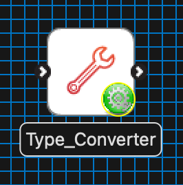
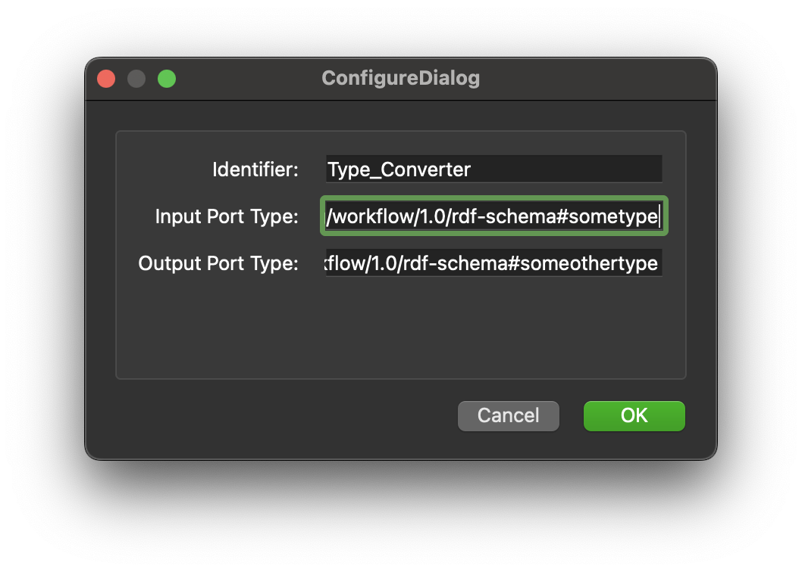

Directory Chooser
=================

Overview
--------
The **Type Converter** is MAP Client plugin for converting a providing type from it's specified type to another type.

Workflow Connections
--------------------

As shown in :numref:`fig-mcp-type-converter-workflow-connections`, the **Type Converter** requires a single user specified input.

It produces one output, the type of which is user specified, which may be piped to other workflow steps:

.. _fig-mcp-directory-chooser-workflow-connections:

   **Type Converter** workflow connections.

Information on this plugins' specification is available :ref:`here <mcp-directory-chooser-specification>`.

Configuration
-------------

This step is used for converting types from a providing port of one type to a using port of another.

You must set the input and output type **before** connecting to other steps in the workflow.
The user is free to set the input and output types to any type they might wish, however the expectation is that the types will be compatible, MAP Client will **not** check this.

.. _fig-mcp-type-converter-configure-dialog:

   **Type Converter** step configuration dialog.

Instructions
------------

This is a non-interactive step.
See `Configuration`_.
